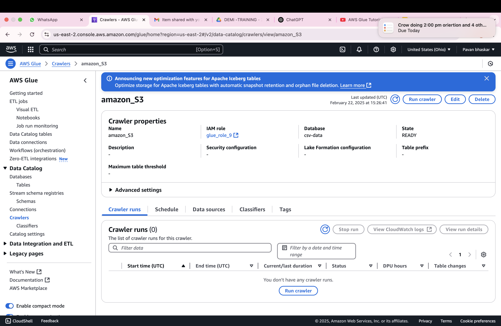
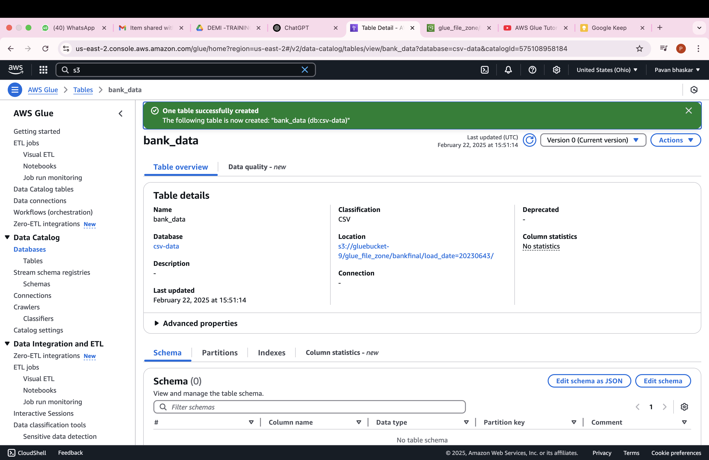
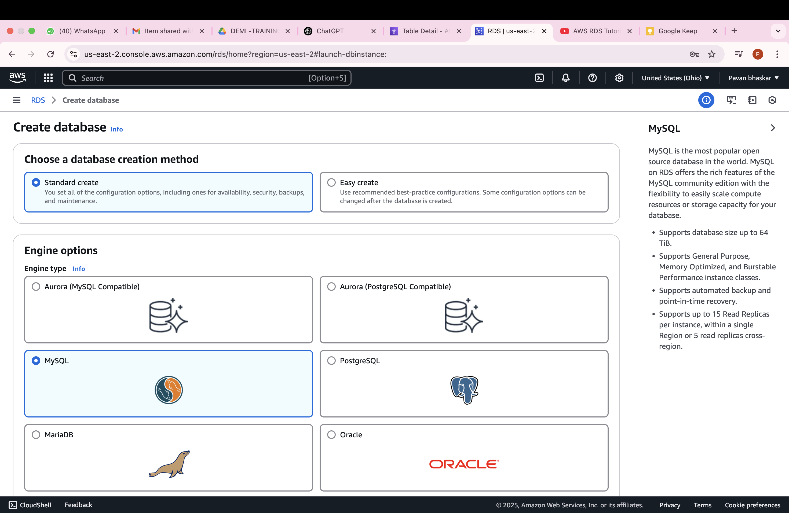
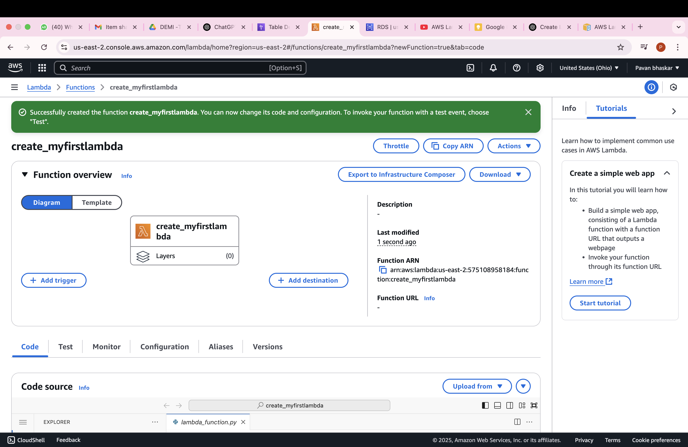
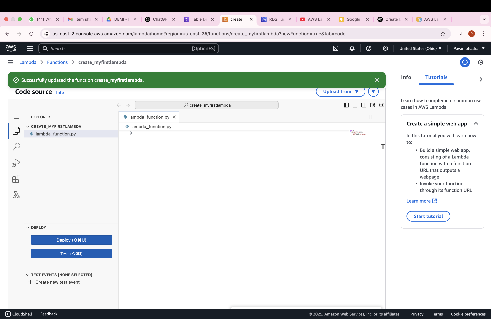

# AWS #
AWS S3, AWS Glue, RDS, and DMS are all services provided by Amazon Web Services (AWS) for different data-related tasks. Here's an overview of each service, its purpose, and how they are used:

1. ## Amazon S3 (Simple Storage Service) ##
Purpose:

AWS S3 is a scalable, object storage service used for storing and retrieving any amount of data at any time. It is highly durable and available, often used for backups, static website hosting, and data storage for big data analytics.
Uses:

Data Storage: Storing large amounts of unstructured data such as images, videos, backups, logs, etc.
Data Archiving: S3 is commonly used for long-term storage of infrequently accessed data, such as backup files or old logs.
Big Data: S3 is a key component in big data workflows where data is stored and processed (e.g., in data lakes).
Hosting Static Websites: You can host static files such as HTML, CSS, JavaScript, and images.

# AWS S3 With Python and Cli #
 # Prerequisites # 
 AWS account 
 aws CLI installed and Configured
 Boto3 library installed

# AWS CLI Configuration #
1. install the aws cli :
 pip install awscli

 2 . Configure the aws cli with your credentials:
 aws configure

3 . Using AWS CLI to Manage S3 Buckets
create a new S3 bucket 
aws s3 md s3://my-new-bucket
4 .list of S3 Bucket
aws S3 ls
5 . Upload a file to an s3 Bucket:
aws s3 cp local-file.txt s3://my-new-bucket/uploaded-file.txt

Create a Bucket
To create a new S3 bucket:
aws s3 mb s3://my-new-bucket-name
Download a File from S3
To download a file from S3:

bash
Copy
aws s3 cp s3://my-new-bucket-name/file.txt /path/to/local/destination/

2. ## AWS Glue ##
Purpose:

AWS Glue is a fully managed ETL (Extract, Transform, Load) service that makes it easier to prepare and load data for analytics. It simplifies the data transformation process and data integration from various sources.
Uses:

ETL Pipelines: Extract data from multiple sources, transform it (cleaning, filtering, aggregating), and load it into data stores like S3, RDS, or Redshift.
Data Cataloging: Glue automatically crawls data sources and organizes metadata into a central catalog, making data discovery easier.
Data Preparation: Allows you to clean and preprocess data before using it for analytics, machine learning, or reporting.
Serverless: It runs without requiring the user to manage the underlying infrastructure.

3. ## Amazon RDS (Relational Database Service) ##
Purpose:

Amazon RDS is a fully managed relational database service that supports various database engines (MySQL, PostgreSQL, SQL Server, MariaDB, and Amazon Aurora). It handles database administration tasks like backups, patching, and scaling.
Uses:

Database Hosting: Hosting relational databases for applications that require structured data and SQL-based querying.
Scalable Database: Easily scale databases for performance or storage capacity based on demand.
Managed Databases: RDS handles administrative tasks like patching, backups, and automatic failover, reducing the need for manual intervention.
Integration with Applications: It is used by web and enterprise applications for storing transactional data, customer data, or logs.
 
 # AWS RDS Setup Guide #
 prequisites 
 an active aws account 
 necessary permissions to create RDS instances
 steps to create RDS 
 Create an RDS for MariaDB, RDS for MySQL, or RDS for PostgreSQL DB instance that maintains the data used by a web application.

RDS for MariaDB

RDS for MySQL

RDS for PostgreSQL
To create a MySQL DB instance
Sign in to the AWS Management Console and open the Amazon RDS console at 

In the upper-right corner of the AWS Management Console, check the AWS Region. It should be the same as the one where you created your EC2 instance.

In the navigation pane, choose Databases.

Choose Create database.

On the Create database page, choose Standard create.

For Engine options, choose MySQL.

Select engine type

Templates
Choose a sample template to meet your use case. 
 i choose the free 

4.  ## AWS DMS (Database Migration Service) ##
Purpose:

AWS DMS helps you migrate databases to AWS with minimal downtime. It supports migrations from on-premise databases to RDS or other AWS data stores. It can also replicate data between databases.
Uses:

Database Migration: Migrating databases from on-premise systems or other cloud platforms to AWS (e.g., from SQL Server to Amazon RDS or Aurora).
Continuous Data Replication: DMS can replicate data from one database to another, enabling scenarios such as disaster recovery, real-time data synchronization, or cross-region data replication.
Hybrid Cloud Data Architectures: For organizations with hybrid cloud environments, DMS can help ensure that databases in on-premise systems and cloud services remain synchronized.

Summary of the Key Purposes:
S3: Data storage and archiving for various file types.
Glue: ETL data processing and integration across multiple sources.
RDS: Managed relational database hosting.
DMS: Database migration and replication to AWS.

5. ## AWS IAM ##
(Identity and Access Management) allows you to manage access to AWS resources securely. IAM users are entities that you create within your AWS account to represent individuals or applications that need to interact with AWS services.

Key Concepts of IAM Users:
IAM User: A user represents a person or service that needs to authenticate and interact with AWS resources. Each user has a unique set of credentials (username, password, and optionally access keys) to sign into the AWS Management Console, AWS CLI, or AWS SDKs.

IAM Group: A group is a collection of IAM users. You can attach permissions to a group, and all users in the group inherit those permissions. This helps simplify permission management for multiple users.

IAM Policies: IAM policies define what actions an IAM user can perform on which resources. Policies are written in JSON and can be attached to users, groups, or roles. These policies define permissions like read, write, or delete for specific AWS services.

Access Keys: IAM users can be assigned access keys that allow them to interact with AWS services programmatically via the AWS CLI, SDKs, or APIs. These keys consist of an Access Key ID and a Secret Access Key.

Permissions: You can grant permissions to IAM users using:

Managed Policies: Predefined policies created by AWS, like AdministratorAccess, AmazonS3FullAccess, etc.
Inline Policies: Custom policies that are embedded directly into a user or group.
Multi-Factor Authentication (MFA): You can enable MFA for IAM users to add an extra layer of security. This requires users to authenticate with a second factor, such as a time-based code from a device.

6. ## AWS Lambda ##
AWS Lambda Overview
AWS Lambda is a fully managed serverless compute service provided by Amazon Web Services (AWS). It allows you to run code in response to specific events, such as changes in data, application state, or HTTP requests, without the need to provision or manage servers.

Key Features of AWS Lambda:
Serverless Computing:

With Lambda, you don’t need to manage infrastructure. You simply upload your code, define how it should be triggered, and Lambda handles the rest (e.g., scaling, availability, etc.).
No need to provision or manage servers.
Event-Driven:

Lambda functions are typically invoked by events from other AWS services or HTTP requests via API Gateway.
Examples of event sources include:
S3: File uploads trigger Lambda.
DynamoDB: Item changes in a table trigger Lambda.
SNS: Messages sent to an SNS topic trigger Lambda.
SQS: Messages in an SQS queue trigger Lambda.
API Gateway: HTTP requests trigger Lambda via REST APIs.
Scaling:

Lambda automatically scales your application by running code in response to each trigger, scaling from a few requests per day to thousands per second.
It scales automatically based on the volume of incoming events.
Pay-As-You-Go Pricing:

Lambda charges based on the number of requests and the duration of your code execution. You pay only for the compute time you consume, with no upfront cost.
Pricing is based on:
Number of requests: Lambda charges $0.20 per 1 million requests.
Duration: You are billed for the actual execution time of your code (rounded to the nearest 100 milliseconds).
Supports Multiple Languages:

# Lambda supports various programming languages such as: #
Python
Node.js
Java
Go
C# (.NET Core)
Ruby
Custom runtimes (you can bring your own runtime).
Integration with AWS Services:

Lambda can directly integrate with many AWS services, enabling powerful event-driven applications.
Examples of services that can trigger Lambda functions include S3, DynamoDB, SNS, SQS, CloudWatch, and more.

To create and deploy an AWS Lambda function using Python, you can follow these steps:
Explanation:
lambda_handler(event, context): The entry point for AWS Lambda. It receives event (the input data passed to Lambda) and context (runtime information about the function).
json.dumps: Converts data to JSON format.

